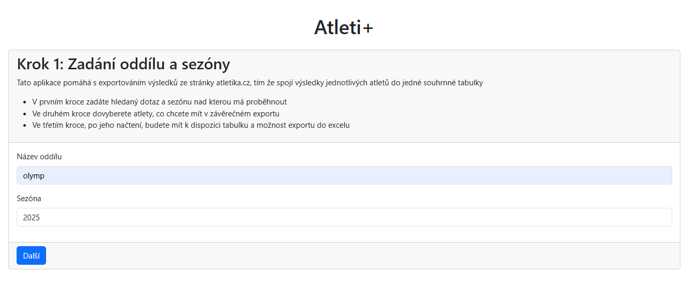
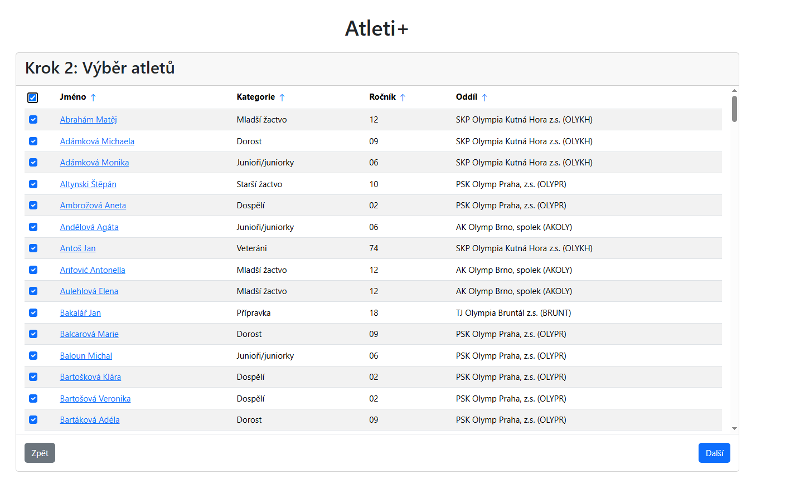
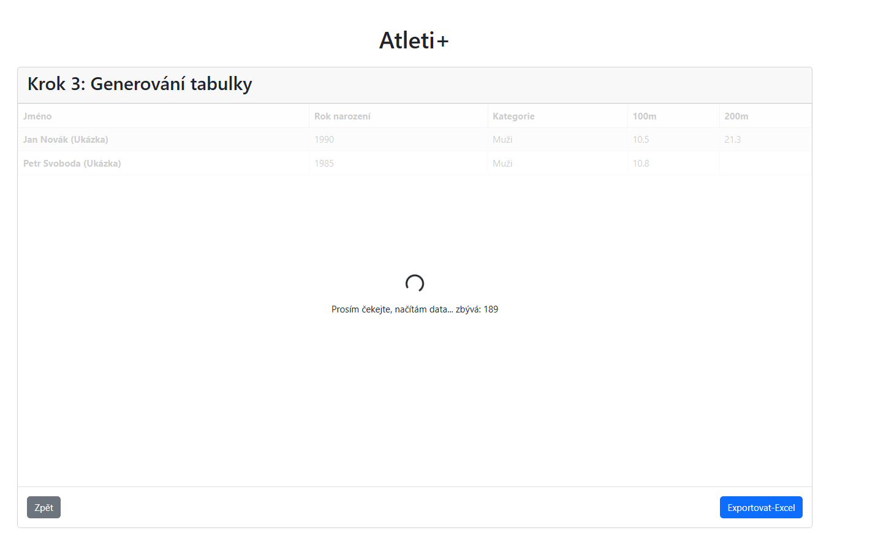
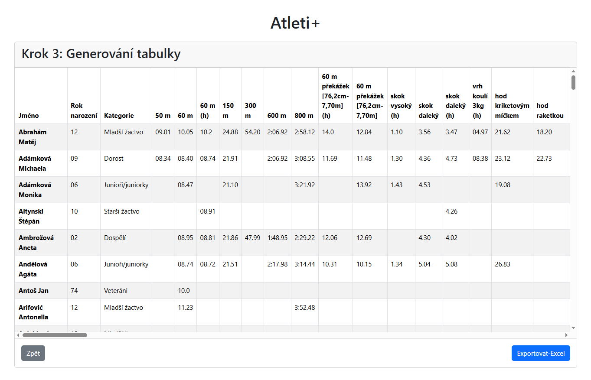

# AtletiPlus
Cílem aplikace je umožnit oddílům získat přehled o nejlepších výkonech svých atletů v jedné tabulce. Aplikace bude sloužit pro plánování závodů a usnadnění práce, která se aktuálně dělá manuálně ,,atlet po atletovi, tabulka po tabulce". 

## screenshoty průběhu aplikace 

### techničtější detaily 
Aplikace je psaná v rámci školního projektu _není úplně dokončená_ nicméně základní smyčka by měla fungovat
používá Javascript a bootstrap, dotazy na atletika.cz jsou pomocí PHP 
