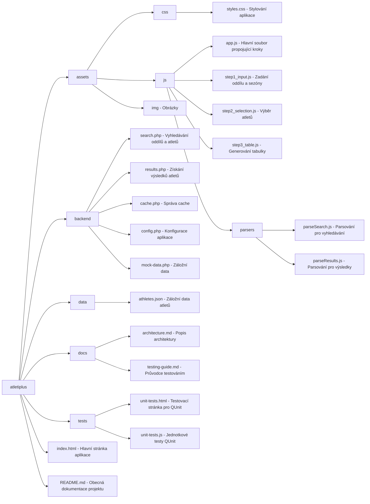

# Architektura projektu 
Tato sekce popisuje strukturu projektu "Atletiplus" a jednotlivé složky a jejich účel. 
 
## Struktura 
``` 
atletiplus 
├── assets 
│   ├── css\styles.css         # Stylování aplikace 
│   ├── js\app.js             # Hlavní soubor propojující kroky 
│   ├── js\step1_input.js     # Logika pro zadání oddílu a sezóny 
│   ├── js\step2_selection.js # Logika pro výběr atletů 
│   ├── js\step3_table.js     # Logika pro generování tabulky 
│   └── js\parsers 
│       ├── parseSearch.js     # Parsování dat pro vyhledávání oddílů a atletů 
│       └── parseResults.js    # Parsování dat pro výsledky atletů 
├── backend 
│   ├── search.php            # Vyhledávání oddílů a atletů 
│   ├── results.php           # Získání výsledků atletů 
│   ├── cache.php             # Správa cache 
│   ├── config.php            # Konfigurace aplikace 
│   ├── mock-data.php         # Záložní data 
├── data\athletes.json         # Záložní data atletů (JSON) 
├── docs\architecture.md      # Popis architektury projektu 
├── docs\testing-guide.md     # Dokumentace k testování 
├── tests 
│   ├── unit-tests.html       # Testovací stránka pro QUnit 
│   └── unit-tests.js         # Jednotkové testy QUnit 
├── index.html                # Hlavní HTML stránka aplikace 
└── README.md                 # Obecná dokumentace projektu 
``` 
